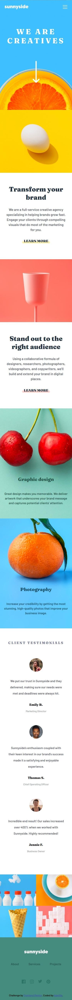
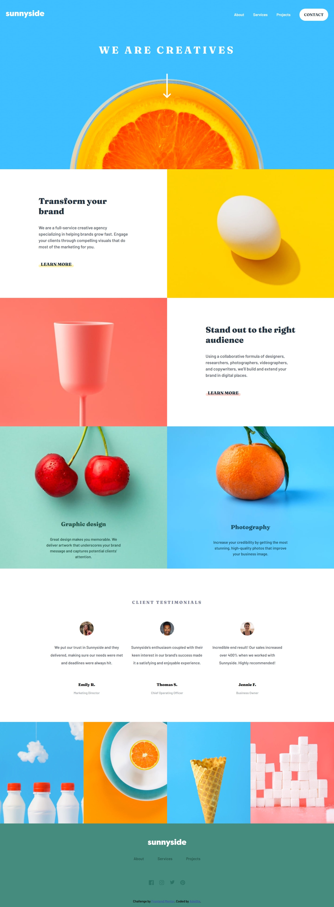

# Frontend Mentor - Sunnyside agency landing page solution

This is a solution to the [Sunnyside agency landing page challenge on Frontend Mentor](https://www.frontendmentor.io/challenges/sunnyside-agency-landing-page-7yVs3B6ef). Frontend Mentor challenges help you improve your coding skills by building realistic projects.

## Table of contents

- [Overview](#overview)
  - [The challenge](#the-challenge)
  - [Screenshot](#screenshot)
  - [Links](#links)
- [My process](#my-process)
  - [Built with](#built-with)
  - [What I learned](#what-i-learned)
  - [Continued development](#continued-development)
  - [Useful resources](#useful-resources)
- [Author](#author)

## Overview

### The challenge

Users should be able to:

- View the optimal layout for the site depending on their device's screen size
- See hover states for all interactive elements on the page

### Screenshot

### Links

- Solution URL: [ solution URL ](https://www.frontendmentor.io/solutions/responsive-landing-page-using-css-flexbox-media-queries-and-js-A_wWzWQ2_)
- Live Site URL: [ live site URL ](https://sunnyside-agency-landing-page-flax.vercel.app/)

## My process

### Built with

- Accessible HTML
- SCSS
- CUBE CSS Methodology
- Fluid Typography
- Flexbox
- Mobile-first workflow

### What I learned

I learned how the flexbasis and order properties can make sizing and ordering layouts easy. I also learned how to apply CUBE CSS Methodology by Andy Bell and fluid typography using a type scale. The implementation of these could be better.

### Continued development

The concept of setting appropriate breakpoints more so the correct way is something I'll be looking to work on, this part was particularly tricky.

### Useful resources

- [Stackoverflow](https://stackoverflow.com) - This helped me for very obvious reasons.
- [Mozilla Developer Network](https://developer.mozilla.org/en-US/docs) - This is has proven to be very resourceful for when I need a refresher on correct syntax.

## Author

- Frontend Mentor - [@Adej0la](https://www.frontendmentor.io/profile/Adej0la)
- Twitter - [@\_adejola](https://www.twitter.com/_adejola_)
